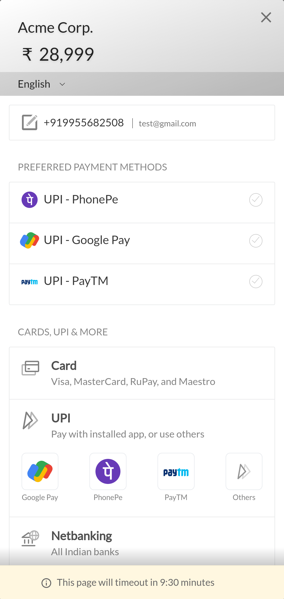

## Flutter Firebase Ecommerce App (For Consumers Only) ##
***Screenshots***
 

***Modules***
- Login / sign up using phone number (Using Firebase Authentication).
- User Profile -> Fields (Image, First Name, Last Name, Phone Number, User Id) (Profile images are stored in Firebase Storage).
- Home Screen CMS controlled by Database -> highlights, top categories and banner Data.
- User Addres -> Add, remove, edit and set an address as default.
- User Orders -> Place and cancel order.
- User Wishlist -> Add / remove product from wishlist, move product to cart from wishlist.
- User Notification -> List / remove notifications.
- User Cart -> Add / remove from cart, move product to wishlist from cart. Place a new order.
- Voice Search -> Search products by using voice commands.
- Text Seach -> Seach for products by product name.
- Edit Profile -> Edit first name, last name and profile image.
- Delete Account -> Delete the account from Firebase Authentication and user data from Firebase Firestore.
 

***Technologies used*** -
- Flutter & Dart
- Google Firebase
  - Firebase Authentication (for authentication)
  - Firebase Firestore (for database)
  - Firebase Storage (for storing files)
- Razorpay (as payment provider)
- OneSignal (for push notification related services)
 

***Flutter packages used (with pub.dev link)*** -

Name | Link
------------- | -------------
avatar_glow  | https://pub.dev/packages/avatar_glow
cached_network_image | https://pub.dev/packages/cached_network_image
cloud_firestore  | https://pub.dev/packages/cached_network_image
colorful_safe_area | https://pub.dev/packages/colorful_safe_area
country_calling_code_picker | https://pub.dev/packages/country_calling_code_picker
dio | https://pub.dev/packages/dio
dynamic_height_grid_view | https://pub.dev/packages/dynamic_height_grid_view
firebase_auth | https://pub.dev/packages/firebase_auth
firebase_core | https://pub.dev/packages/firebase_core
firebase_storage | https://pub.dev/packages/firebase_storage
flutter_dotenv | https://pub.dev/packages/flutter_dotenv
flutter_remix | https://pub.dev/packages/flutter_remix
flutter_speech | https://pub.dev/packages/flutter_speech
hive | https://pub.dev/packages/hive
hive_flutter | https://pub.dev/packages/hive_flutter
image_picker | https://pub.dev/packages/image_picker
intl | https://pub.dev/packages/intl
jiffy | https://pub.dev/packages/jiffy
oktoast | https://pub.dev/packages/oktoast
onesignal_flutter | https://pub.dev/packages/onesignal_flutter
permission_handler | https://pub.dev/packages/permission_handler
pin_code_text_field | https://pub.dev/packages/pin_code_text_field
provider | https://pub.dev/packages/provider
razorpay_flutter | https://pub.dev/packages/razorpay_flutter
skeletons | https://pub.dev/packages/skeletons
smooth_page_indicator | https://pub.dev/packages/smooth_page_indicator
splash_screen_view | https://pub.dev/packages/splash_screen_view
swipeable_page_route | https://pub.dev/packages/swipeable_page_route
tap_debouncer | https://pub.dev/packages/tap_debouncer
uuid | https://pub.dev/packages/uuid
validators | https://pub.dev/packages/validators
